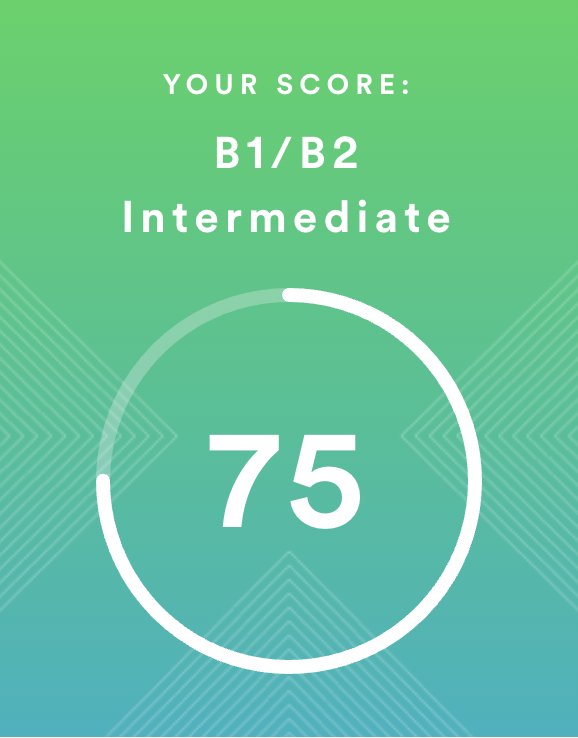

# Olga Solina
## Contact Information -
**Phone**: +7 950 440 61 38
**E-mail**: ollsollina@gmail.com
**Telegram**: @ollsoll
**GitHub**: oll-soll

## Briefly About Myself -
I'm drawn to the IT field. I love seeing the results of my work and influencing the growth of projects. I'm a team player, yet I take responsibility for tasks independently and demonstrate initiative.
I'm not afraid of routine work. I'm attentive, diligent, and motivated to grow as a professional.

## Skills and Proficiency -
- HTML5, CSS3
- JavaScript Basics (In progress)
- Git, GitHub
- VS Code, IntelliJ IDEA
- Adobe Photoshop, Illustrator, Figma

## Code Example - 
**Simple JavaScript Multiplication Function**
- Task: Implemented a multiply function passing all test cases on CodeWars.
- Code example:
```javascript
function multiply(a, b) {
  return a * b;
}
```

## Education - 
- PGPU (Perm State Humanitarian Pedagogical University)
- RS Schools Course «JavaScript/Front-end. Stage 1» (In progress)

## English - 
- B1/B2 Intermediate (according to the online test at [EFset](https://www.efset.org/quick-check/))
